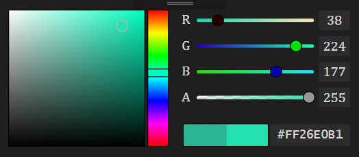

# ColorControl
The _ColorControlPanel_ class represents the color picker panel and it is derived from the WPF _UserControl_ class. 
The following public members and Dependency Properties (DP) of the _ColorControlPanel_ are mainly in use:  
  
- _SelectedColor_ gets a currently picked color  
- _ColorChanged_ event occurs when the _SelectedColor_ is changed  
- DP _InitialColorBrush_ gets/sets the initial color to which you can return by clicking the left rectangle  
- DP _SelectedColorBrush_ gets/sets the _SelectedColor_  
- DP _TextBoxBackground_, _TextBoxBorder_, _TextForeground_ can be used for styling
  
Included lightweight test project represents template of usage of the _ColorControlPanel_.  
  

